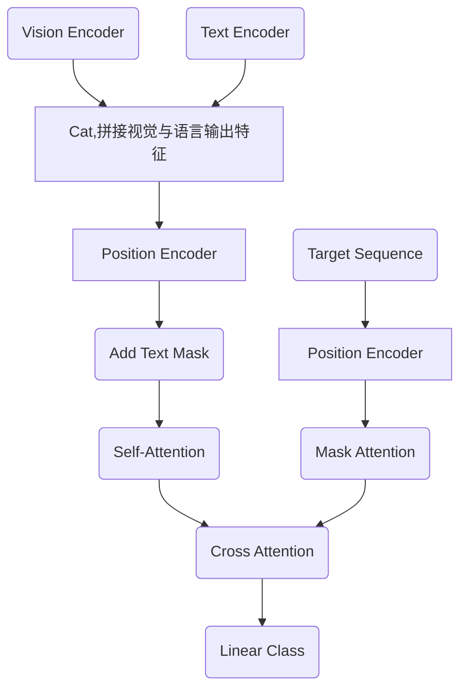

# SkyFind paper 的复现记录（复现日志）
 因为鄙人最近看到该论文时，在github上没有看到原作者目前开源源代码，鄙人为了深入代码和理论相结合学习，所以就复现了该源码。源码是由AI与鄙人一起合作的结果。代码的注释很详细了。

 采用SeqTR为baseline，使用的是生成式。“分词器”的baseline采用的是bert-base-uncased。
 需要把图片和文本映射到同一个维度的特征空间，Encoder使用的DarkNet-53与“双向GRU”（bert-base-uncased是分词器，这里的GRU是特征提取器）。因为注意力机制对顺序不敏感（不知道顺序，也根本没关注过顺序），所以需要手动加入位置编码，本实验采用的正余弦位置编码。

 环境：显卡L20 48G，内存246G，CPU 10核心，当然本次实验没有把所有的这些硬件配置跑满，自己看自己的硬件配置手动更改批次大小、词token数量及图片resize尺寸即可训练。

```
 包环境配置：

```

 在开始全量数据跑通前，先开始跑单批次过拟合的测试，查看loss是否下降，整个前向传播与后向传播架构能否经得住测试，看模型到整个梯度的数据流是否无bug。

 当测试各个单个模块文件时，需要把导入的自定义模块路径删掉比如data.transforms-> transforms。解决方法是永远使用绝对路径导入（带上目录路径或文件夹路径），只把项目根目录当作中心。比如我们要运行data/dataset.py时，因为只把项目的根目录当作中心，导入时还是导入data.transforms、data.label_generator，运行单独测试data/dataset.py时，不使用python data/dataset.py ，而是使用python -m data.dataset。

 本论文说是两阶段，但是其实网络结构里面没有体现两阶段（其实鄙人也不断定，但因为目前截止到5 month-12 day-2026 year未找到原作者的源码，而且这只是插件的话，就是一个软两阶段吧），只是在坐标回归生成序列时，先回归生成第一阶段大框的坐标，再后生成第二阶段精细框的坐标，所以也算是两阶段。所以原论文作者的方法是一个很通用的方法，不需要改网络结构，可以直接即插即用去提升指标，但是定性来说的话，这样会花费更多时间，毕竟是生成式一个一个词的输出。如果冒昧了，先说声抱歉，还请包涵，联系鄙人，鄙人道歉，感谢。

 1.seqtr_aerial.py 、train_overfit.py、train.py需要认真看看。

 2.图片有些是坏掉了，应该跳过。√

 3.保存训练最佳权重时，目前没有使用验证集来验证。直接使用的训练集的损失比较。

 4.使用测试集来测试模型（需要推理的代码）的指标。

 5.使用热力图分析第一阶段是否能大致确定目标区域。

 6.训练速度太慢，损失下降也非常慢（第一轮到第十三轮，总平均损失才下降0.8左右）。

----------------------------------
为了方便不记那么多命令，直接写了train.sh是自定义的训练脚本，先升级权限 chmod +x train.sh， 再直接./train.sh。但是为了保护硬盘寿命、提高读写效率，操作系统默认：只有当积攒够了一定数量的字符（通常是 4KB 或 8KB 内存块）时，才会一次性把数据写入到硬盘上的定向到的文件里。解决方案（为了实时刷新查看）：1.在 Python 的 print 函数里加一个参数：print(f"...", flush=True)；2.nohup python -u train.py > train.log 2>&1 &
 ```
 nohup python train.py > train.log 2>&1 &
 使用的nohup python train.py > train.log 2>&1 & 
 > train.log 2>&1 &
 >：标准输出到文件
 2>&1：把标准错误也重定向到同一个文件
 &：后台运行

 杀死后台用 （杀死该进程任务）
 pkill -9 train.py or PID
 pkill -f train.py
 实时查看训练状态
 tail -f train.log
 查看日志文件用tail -f train.log
 实时查看显卡状态
 watch -n 1 nvidia-smi
 ```

 **关于本次复现实验，编写代码文件的顺序如下（一定程度反映了流程）：**
 
 ```mermaid
 graph TB
 A(data/label_generator.py)-->B(data/transforms.py)-->C(data/dataset.py)
 A-.->C
 C-->D(models/encoders.py)-->E(seqtr_aerial.py)-->F(train_overfit.py)-->G(train.py)
 E-.->F
 C-.->F
 E-.->G
 C-.->G
 ```
**训练时，前向网络信号流向图：**


**我已经快被里面的文本掩码、注意力掩码、GRU里面的掩码绕晕了。不过我又绕回来了，win**
```
之前的代码未在GRU里面引入文本掩码，污染了真实的token时的隐状态，已经改进。
图像与文本拼接后计算自注意力引入掩码，已改进。
目前代码一共有4个地方出现了“掩码”。第一个地方GRU，防止补齐的tokens对真实tokens的污染，以及防止更新补齐tokens的隐藏状态（防止影响下一步自注意力的计算）；第二个地方是文本与图像拼接后计算自注意力时，防止对补齐的tokens做无效的注意力计算，浪费时间；第三个地方为了因果性，对目标序列做掩码注意力，这里是使用了下三角掩码矩阵后，目标序列自己做了自注意力；第四个地方做交叉注意力时，防止Decoder注意到Encoder输出的文本补齐tokens。

1.  GRU 的 序列打包掩码（`pack_padded_sequence`）：
       作用：防止 `<PAD>` 更新隐藏状态，杜绝双向传播时的“历史污染”。保证提取出的文本特征是 100% 纯净的。
2.  Encoder 自注意力的 填充掩码（`src_key_padding_mask`）：
       作用：在图像与文本拼接后（440 长度），强行切断图像像素对文本 `<PAD>` 的注意力。防止无效计算，更重要的是防止图像特征被无意义的零向量稀释。
3.  Decoder 自注意力的 下三角因果掩码（`tgt_mask`）：
       作用：维护时间箭头的单向性（自回归属性）。强制模型在预测第 $t$ 个坐标时，只能依赖前 $t-1$ 个坐标，绝对禁止偷看未来。
4.  Decoder 交叉注意力的 记忆填充掩码（`memory_key_padding_mask`）：
       作用：当 Decoder 拿着坐标去 Encoder 提取特征时，告诉 Decoder：“只准看图像和真实的文本，遇到 Encoder 传过来的文本 `<PAD>`，请自动忽略”。
```

-------------------
因为第一次全量训练时，未引入掩码在有补齐的tokens时。目前正在修改代码，关于引入掩码，以及加速训练（加速loss下降，加速收敛）。而且打算把第一次保存的模型权重（因为没有修改任何网络层，只是改变了前向传播的数据控制流）作为第二次全量训练的预训练权重（应该能节省一点时间吧）。