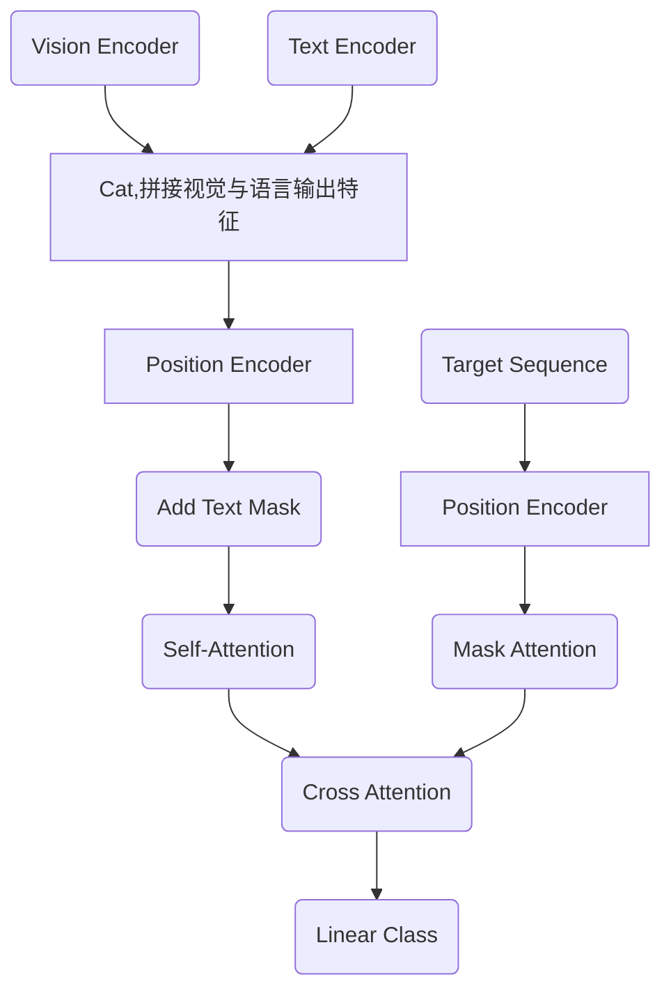

# SkyFind paper 的复现记录（复现日志）
## 随意日志

**文件结构：**

```
PaperReproduction-SKYFIND/            # 项目根目录
│
├── data/                             # 数据流与标签引擎 (严苛拦截一切脏数据)
│   ├── label_generator.py            # 【核心机理】，生成 [PTR, PTBB] 两阶段坐标标签
│   ├── transforms.py                 # 【特征映射】图像尺寸归一化，及连续坐标到1000个离散Token的物理映射
│   └── dataset.py                    # 【防线中枢】PyTorch Dataset，包含脏图随机替换容错、BERT离线分词
│
├── models/                           # 神经网络架构引擎 (解耦)
│   ├── encoders.py                   # 【纯净特征】从零手写且无预训练的 DarkNet-53 (视觉) 与 双向GRU (语言)
│   └── seqtr_aerial.py               # 【核心大脑】多模态融合Transformer，以及包含“4大防污染掩码”的自回归Decoder
│
├── engine/                           # 验证与几何推理引擎
│   └── evaluator.py                  # 【脱离拐杖】负责自回归贪心解码(While循环)、坐标逆向映射、交并比(IoU)计算
│
├── local_bert_tokenizer/             # 纯内网离线字典库 (因为可能有些不能连接到huggingface)
│   ├── vocab.txt                     # 30522行核心词典
│   ├── config.json                   
│   ├── tokenizer.json                
│   └── tokenizer_config.json         
│
├── checkpoints/                      # 权重保险箱 (最新权重与最优权重)，因为权重有219M左右，所以不放到github上了
│   ├── latest_model.pth              # 最新一轮权重，用于随时断点续训
│   └── best_model1.pth               # 验证集Loss最低的“黄金权重”
│
├── demo_results/                     # 图像化验证输出目录
│   ├── demo_1_004851.jpg             # demo.py 输出的红绿框对比图
│	|--......
|
├── train_overfit.py                  #  科研试金石：单批次过拟合脚本 (用于测试梯度流是否绝对畅通)
├── train.py                          #  全量极速训练中枢：集成 BF16 半精度、Warmup 余弦退火、NaN防御
├── test.py                           #  全量量化评测脚本：遍历验证集，计算并打印最终的 IoU@50 成绩
├── demo.py                           #  定性分析脚本：随机抽取样本画框对比
├── app.py                    		  #  模拟部署脚本：输入任意单图+指令，模拟无人机真实环境下的前向推理
├── analysis.py                       #  热力图：提取 Transformer 内部 Cross-Attention，生成热力图
│
└── requirements.txt                  #  极简依赖清单：仅依赖 torch, torchvision, opencv, pillow 等基础库
```

**本次训练权重下载位置：**1.https://1853792917.share.123865.com/123pan/71JPvd-1Opbd（123云盘的分享，不过好像不能免登录下载了，要登陆）

2.reverseKang/skyfindReproduction（huggingface里面搜索里面搜这个，之后在文件里面下载best_model1.pth）

因为鄙人最近看到该论文时，在github上没有看到原作者目前开源源代码，鄙人为了深入代码和理论相结合学习，所以就复现了该源码。源码是由AI与鄙人一起合作的结果。代码的注释很详细了。

 采用SeqTR为baseline，使用的是生成式。“分词器”的baseline采用的是bert-base-uncased。
 需要把图片和文本映射到同一个维度的特征空间，Encoder使用的DarkNet-53与“双向GRU”（bert-base-uncased是分词器，这里的GRU是特征提取器）。因为注意力机制对顺序不敏感（不知道顺序，也根本没关注过顺序），所以需要手动加入位置编码，本实验采用的正余弦位置编码。

 **环境：**显卡L20 48G，内存246G，CPU 10核心，当然本次实验没有把所有的这些硬件配置跑满，自己看自己的硬件配置手动更改批次大小、词token数量及图片resize尺寸即可训练。

**Dataset：**SkyFind

**操作流程:**

```bash
#训练模型时
conda create --name skyfind python=3.12 -y
conda activate skyfind
pip install -r requirements.txt

python train.py #或者使用 nohup python train.py > skyfind.log 2&1 &
#对模型的推理检验
python app.py #可直接对一张图进行测试，输入张图和一个指令，会自动框出目标
#对验证集的评估
python test.py
```

 在开始全量数据跑通前，先开始跑单批次过拟合的测试，查看loss是否下降，整个前向传播与后向传播架构能否经得住测试，看模型到整个梯度的数据流是否无bug。

 当测试各个单个模块文件时，需要把导入的自定义模块路径删掉比如data.transforms-> transforms。解决方法是永远使用绝对路径导入（带上目录路径或文件夹路径），只把项目根目录当作中心。比如我们要运行data/dataset.py时，因为只把项目的根目录当作中心，导入时还是导入data.transforms、data.label_generator，运行单独测试data/dataset.py时，不使用python data/dataset.py ，而是使用python -m data.dataset。

 本论文说是两阶段，但是其实网络结构里面没有体现两阶段（其实鄙人也不断定，但因为目前截止到5 month-12 day-2026 year未找到原作者的源码，而且这只是插件的话，就是一个软两阶段吧），只是在坐标回归生成序列时，先回归生成第一阶段大框的坐标，再后生成第二阶段精细框的坐标，所以也算是两阶段。所以原论文作者的方法是一个很通用的方法，不需要改网络结构，可以直接即插即用去提升指标，但是定性来说的话，这样会花费更多时间，毕竟是生成式一个一个词的输出。如果冒昧了，先说声抱歉，还请包涵，联系鄙人，鄙人道歉，感谢。

 1.seqtr_aerial.py 、train_overfit.py、train.py需要认真看看。√

 2.图片有些是坏掉了，应该跳过。√

 3.保存训练最佳权重时，目前没有使用验证集来验证。直接使用的训练集的损失比较。√

 4.使用测试集来测试模型（需要推理的代码）的指标。√

 5.使用热力图分析第一阶段是否能大致确定目标区域。√

 6.训练速度太慢，损失下降也非常慢（第一轮到第十三轮，总平均损失才下降0.8左右）。√ ×

----------------------------------
为了方便不记那么多命令，直接写了train.sh是自定义的训练脚本，先升级权限 chmod +x train.sh， 再直接./train.sh。但是为了保护硬盘寿命、提高读写效率，操作系统默认：只有当积攒够了一定数量的字符（通常是 4KB 或 8KB 内存块）时，才会一次性把数据写入到硬盘上的定向到的文件里。解决方案（为了实时刷新查看）：1.在 Python 的 print 函数里加一个参数：print(f"...", flush=True)；2.nohup python -u train.py > train.log 2>&1 &
 ```
 nohup python train.py > train.log 2>&1 &
 使用的nohup python train.py > train.log 2>&1 & 
 > train.log 2>&1 &
 >：标准输出到文件
 2>&1：把标准错误也重定向到同一个文件
 &：后台运行

 杀死后台用 （杀死该进程任务）
 pkill -9 train.py or PID
 pkill -f train.py
 实时查看训练状态
 tail -f train.log
 查看日志文件用tail -f train.log
 实时查看显卡状态
 watch -n 1 nvidia-smi
 ```

 **关于本次复现实验，编写代码文件的顺序如下（一定程度反映了流程）：**

 ```mermaid
 graph TB
 A(data/label_generator.py)-->B(data/transforms.py)-->C(data/dataset.py)
 A-.->C
 C-->D(models/encoders.py)-->E(models/seqtr_aerial.py)-->F(train_overfit.py)-->G(train.py)-->H(engine/evaluator.py)
 E-.->F
 C-.->F
 E-.->G
 C-.->G
 H-->I(test.py)-->J(demo.py)-->K(app.py)-->L(analysis.py)
 ```
**训练时，前向网络信号流向图：**


**我已经快被里面的文本掩码、注意力掩码、GRU里面的掩码绕晕了。不过我又绕回来了，win**

​	之前的代码未在GRU里面引入文本掩码，污染了真实的token时的隐状态，已经改进。
​	图像与文本拼接后计算自注意力引入掩码，已改进。
​	目前代码一共有4个地方出现了“掩码”。第一个地方GRU，防止补齐的tokens对真实tokens的污染，以及防止更新补齐tokens的隐藏状态（防止影响下一步自注意力的计算）；第二个地方是文本与图像拼接后计算自注意力时，防止对补齐的tokens做无效的注意力计算，浪费时间；第三个地方为了因果性，对目标序列做掩码注意力，这里是使用了下三角掩码矩阵后，目标序列自己做了自注意力；第四个地方做交叉注意力时，防止Decoder注意到Encoder输出的文本补齐tokens。

1.  GRU 的 序列打包掩码（`pack_padded_sequence`）：
       作用：防止 `<PAD>` 更新隐藏状态，杜绝双向传播时的“历史污染”。保证提取出的文本特征是 100% 纯净的。
2.  Encoder 自注意力的 填充掩码（`src_key_padding_mask`）：
       作用：在图像与文本拼接后（440 长度），强行切断图像像素对文本 `<PAD>` 的注意力。防止无效计算，更重要的是防止图像特征被无意义的零向量稀释。
3.  Decoder 自注意力的 下三角因果掩码（`tgt_mask`）：
       作用：维护时间箭头的单向性（自回归属性）。强制模型在预测第 $t$ 个坐标时，只能依赖前 $t-1$ 个坐标，绝对禁止偷看未来。
4.  Decoder 交叉注意力的 记忆填充掩码（`memory_key_padding_mask`）：
       作用：当 Decoder 拿着坐标去 Encoder 提取特征时，告诉 Decoder：“只准看图像和真实的文本，遇到 Encoder 传过来的文本 `<PAD>`，请自动忽略”。

-------------------
##  训练改进

​	因为第一次全量训练时，未引入掩码在有补齐的tokens时。目前正在修改代码，关于引入掩码，以及加速训练（加速loss下降，加速收敛）。而且打算把第一次保存的模型权重（因为没有修改任何网络层，只是改变了前向传播的数据控制流）作为第二次全量训练的预训练权重（应该能节省一点时间吧）。因为使用了第一次的权重时，学习到第七轮时，中间第3700批次出现了Loss=nan，后续的所有轮的批次Loss都是nan了，应该是梯度爆炸数值溢出导致（可能是因为AMP的半精度与强行让未引入mask掩码第一次得到的权重导致）。所以不引入第一次保存的权重，也加了一段防止Loss是NAN与INF时污染权重，跳过本批次的梯度更新。

​	本次实验虽然看着很简单，但是鄙人还是用了两周左右才算完成一点，目前其实也未完成（还有消融实验没做、热力图分析没做）。

----------------

## 理论与代码详解

虽然代码里面的注释很清晰了，但是还是补充一些必要的基础在这下面。

**关于代码实现的理论问题**

​	1.训练和测试时必须保持“完全相同”的高维词嵌入表示。但是在训练阶段时，高维词嵌入的表示是会更新的（因为Embedding层只要没被冻结，梯度更新也会传播到Embedding层的权重进行修改，也就是在训练阶段它是可训练的、会更新的）。

​	2.就算推理的时候确实是按顺序输入进去的，得到上一步的预测，拼接后再输入进去，但是还是必须要“下三角掩码”，防止现在干扰过去的特征表示（保护过去）。加上了掩码后，过去的特征永远不变。可以利用把算好的过去特征保存起来，现代的大模型推理时采用的KV-Cache（键值缓存，可以直接不需要下三角掩码）技术加速推理，历史的keys和values保存到缓存库里，输入给Decoder时只需要输入最新生成预测的那个token，不需要像本次实验这样拼接过去与最新预测的输出之后再给Decoder。
​       3.使用了BF16（指数位变多，尾数为变少，因为深度学习对于小数点后面的精度不是很敏感，可以使用BF16），最大整数的范围变大了防止nan和数值溢出，但精度变低，但还是16位，和FP16占用显存相同。
​       4.Encoder输出之后的memory，在标准的Transformer架构中，不能直接当K和V使用，它必须分别乘以两个不同的权重矩阵Wk和Wv（在多头注意力中，会乘以多组矩阵），还要经过线性投影才能真正变成K键和V值，不过本次代码调用的nn.TransformerDecoderLayer 内部会自动生成Wk和Wv权重矩阵（多组），并使用memory分别乘以它们，不需要手动显示的写这个投影层。
​       5.同理，在掩码注意力后输出得到的当前坐标序列的上下文状态，当它和Encoder输出的memory进行查阅时，不能直接使用，而是也要先经过线性投影（查询权重矩阵Wq，多组），乘以权重矩阵（多组）后，转换为真正的Q，不过在nn.TransformerDecoderLayer 内部也定义写好了，自动会计算这一步。所以呀，在任何进入Attention机制的张量，在做内积前，必定会经过一次线性投影。让张量从原有的特征空间转换为适合统一做注意力的空间。
​       6.关于token ID是分词器得来的，Token ID就是永远固定的、不变的，它只是一个词表的索引。我们的分词的token ID是固定不变的（无论什么时候训练和推理时），只是tokens ID对应的高维词嵌入在训练的时候会变化，而且推理的时候词嵌入向量也不变了。

​	7.我们本次只是使用了BERT的分词器Tokenizer词表进行分词，只使用了BERT的字典，可没有使用BERT的任何神经网络模型层。使用的是nn.Embedding层网络，nn.Embedding层与BERT毫无关系。

## Reference paper：

1.SkyFind: A Large-Scale Benchmark Unveiling
Referring Expression Comprehension for UAV

2.AI

3.深度学习进阶：自然语言处理

4.其实还有很多参考文献（难免会涉及到许多不会的），这里只列了主要的参考

## Statement：

本次实验只是小卡拉米复现的大佬们的论文，未涉及到任何权益纠纷，如有任何问题，请联系鄙人。

